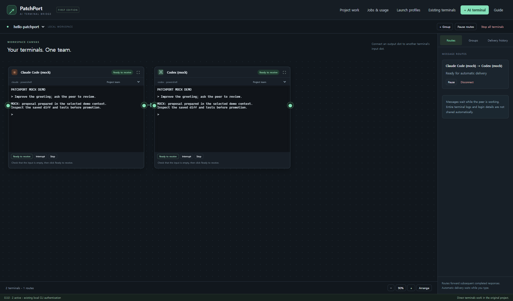
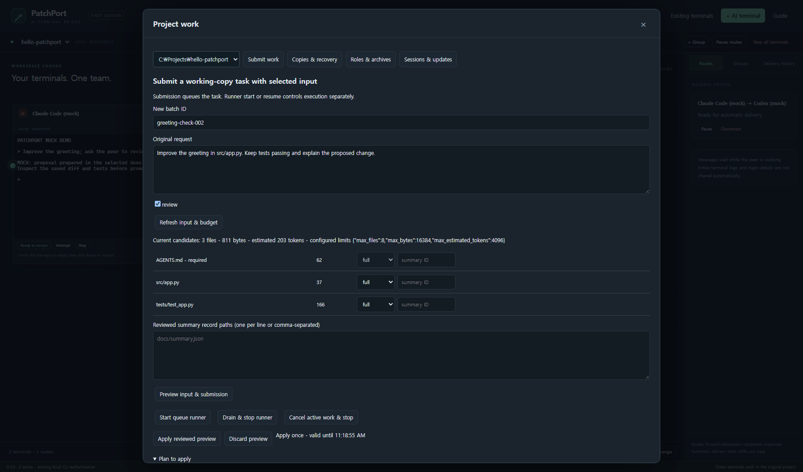

# PatchPort

Connect real Codex and Claude Code terminals in VS Code, or send selected working-copy tasks through a local Python queue. Keep using each CLI's own authentication and permission settings.

PatchPort is MIT-licensed. The VS Code extension is **0.3.0**; the standard-library Python package is named `local-agent-bridge`, with the `agent-bridge` / `python -m agent_bridge` entry points. These version numbers describe different components.



*The screenshots show the actual English extension Webview with controlled demo data, not real provider responses or account usage.*

## Choose how you want to work

| Your goal | Start here | Where files change |
| --- | --- | --- |
| Type directly into AI terminals and connect completed replies | VS Code terminal board | The selected original project |
| Select files, preview input, and queue a task | Project work - Submit work | A separate selected working copy |
| Inspect a proposal and apply chosen paths | Project work - Copies & recovery | Original paths only after explicit promotion |
| Run development, tests and independent review | Project work - Roles & archives | Working copies; promotion remains explicit |
| Use scripts or an existing AI conversation | Python CLI and peer-consult helpers | Selected copies and the existing local queue |

The board is a VS Code extension, not a replacement IDE. Entire terminal logs and whole conversations are not automatically synchronized. Routes forward subsequent completed responses while input-state checks and group limits allow it.

## Start on Windows

The extension is currently validated on **local Windows x64 VS Code**. You need Python **3.11+**, Node.js **24+** to build the extension, Git, and the official provider CLIs you intend to use. Sign in through those CLIs before asking them to do work.

1. Install [VS Code](https://code.visualstudio.com/download), [Python](https://www.python.org/downloads/), and [Node.js](https://nodejs.org/en/download).
2. Follow the official [Codex CLI guide](https://learn.chatgpt.com/docs/codex/cli) and [Claude Code quickstart](https://code.claude.com/docs/en/quickstart) for provider installation and authentication. PatchPort does not provide a shared login or account.
3. Clone and install the current Python source. PowerShell activation is optional:

```powershell
git clone https://github.com/utialy/PatchPort.git
cd PatchPort
py -3 -m venv .venv
.\.venv\Scripts\python.exe -m pip install .
.\.venv\Scripts\python.exe -m agent_bridge --help
```

4. Build a Windows VSIX from this same checkout:

```powershell
cd extensions/vscode
npm ci
npm run package
cd ../..
code --install-extension .bridge/artifacts/patchport-0.3.0-win32-x64.vsix
```

The output is created locally; `.bridge` is not part of the repository. You can also use VS Code's Extensions menu, **Install from VSIX**, and select that file.

5. Open your working project in VS Code. In Settings, search for **PatchPort: Core Python** and set the absolute path to the Python you just installed, for example `C:\Projects\PatchPort\.venv\Scripts\python.exe`. The VSIX includes the core source and workflow tools, but not a Python interpreter.
6. Finish active work, reload the VS Code window, then run **PatchPort: Open AI Terminal Board** from the Command Palette.

Current extension source is not a Marketplace listing or a new downloadable GitHub release. Previously published `0.1.0a2` wheel/release assets predate these workflows; build/install the current source for the features described here.

## Your first two AI terminals

1. Click **+ AI terminal**, select **Claude Code**, your project and **Project team**, then **Start terminal**.
2. Repeat for **Codex**. Complete CLI startup and approval prompts in each terminal.
3. Confirm **Ready to receive** only when the target's input is empty.
4. Click the first card's output dot, then the second card's input dot. Add the reverse arrow if you want replies to travel back.
5. In **Groups**, set a small **Automatic delivery limit** and **Message hop limit**, then resume the group.
6. Type your question in a terminal, submit it, and click outside that terminal. Subsequent completed replies can follow the arrows. Watch **Delivery history** and pause routes whenever you need to intervene.

Direct terminals can modify the original project under the CLI's permissions. For reviewed changes through a copy, use the next workflow instead.

## Your first working-copy task

Connect the target project once using the installed Python:

```powershell
C:\Projects\PatchPort\.venv\Scripts\python.exe -m agent_bridge setup --project C:\Projects\hello-patchport
```

Choose the installed CLIs and the files to share, then inspect and explicitly apply the setup preview. An empty project can use a starter file. Setup preserves existing configuration/rules and does not log in, call an AI or start a runner.

In VS Code, open **Project work**:

1. **Submit work**: enter a new batch ID, your exact request and the endpoint(s). Refresh input, choose full/omit or reviewed summaries, and inspect the input/budget preview.
2. **Apply reviewed preview** queues the task. **Start queue runner** is separate and can execute pending work. Existing pause and lifetime claim limits still apply.
3. **Jobs & usage** shows saved tasks/results and reported consumption. Select the completed task in **Copies & recovery** to inspect the file comparison.
4. Select allowed paths, preview promotion, and apply explicitly. Save or revert overlapping unsaved editor changes first. A backup supports explicit recovery if the original has not been edited incompatibly.



The [detailed VS Code guide](docs/VSCODE_GUIDE.md) walks through every panel with screenshots, custom profiles, role policies, archives, session recovery and troubleshooting.

## Python CLI without the extension

The core runtime uses Python's standard library. Node.js and VS Code are only needed for the extension. After installing the source package, use `agent-bridge setup` and the [CLI reference](docs/CLI.md), or the [peer-consult guide](docs/ROLES.md#connect-codex-and-claude-code) for your existing AI conversation.

On Linux/macOS, create a venv and install the source with:

```sh
python3 -m venv .venv
.venv/bin/python -m pip install .
.venv/bin/python -m agent_bridge --help
```

See [platform validation](docs/VALIDATION.md). WSL/core results do not establish support for the VS Code extension's remote/WSL terminals. The separate [desktop management candidate](desktop/README.md) and [installation sources](packaging/windows/README.md) remain experimental, with additional native/UI/distribution validation outstanding.

## Know what the controls mean

- **Lifetime claims** count batch task starts, including failed/interrupted starts. Changing the cap does not reset consumed claims.
- **Automatic deliveries** count routed input attempts. Manual questions, tokens and charges are separate.
- **Input budgets** limit selected files, bytes and heuristic input estimates. They do not enforce actual provider charges.
- **Reported usage** can be partial or unknown. Missing values are not zero; reported USD is not your subscription bill or remaining quota.
- **Resume** is explicit. Uncertain deliveries and failed provider tasks are not automatically retried.

Remote/other-OS extension sessions, external-process handoff, additional providers, charge enforcement and whole-flow deletion remain outside the validated extension scope.

## Guides and development

| Guide | What it covers |
| --- | --- |
| [VS Code walkthrough](docs/VSCODE_GUIDE.md) | Install, panels, screenshots and troubleshooting |
| [Project setup](docs/SETUP.md) | New/existing projects and preview/apply behavior |
| [CLI](docs/CLI.md) | Command reference |
| [Context selection](docs/CONTEXT.md) / [reviewed summaries](docs/CONTEXT_SUMMARIES.md) | Input plans, required rules and frozen provenance |
| [Roles](docs/ROLES.md) / [archives](docs/ARCHIVES.md) | Developer/test/reviewer flow and retained evidence |
| [Usage](docs/USAGE.md) | Recorded consumption and unknown values |
| [Runner management](docs/RUNNER_MANAGEMENT.md) | Start, pause, drain/cancel and durable identity |
| [Architecture](docs/ARCHITECTURE.md) / [validation](docs/VALIDATION.md) | Runtime boundaries and actual test coverage |

For contributions, read [CONTRIBUTING.md](CONTRIBUTING.md). Run Python tests with the package installed, and run `npm run check`, `npm test` and `npm run package` from `extensions/vscode`. Real provider calls require separate authorization and a stated call limit.
